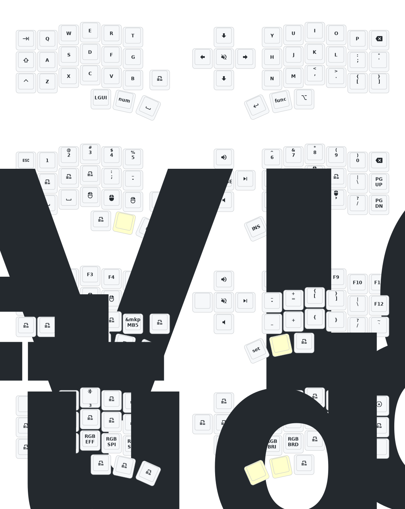

#     Corne ZMK Repository
[Keymap Editor](https://nickcoutsos.github.io/keymap-editor/) to remap easier. 

## Keymap Diagram



## Mouse Support

:warning: This repository defaults to an EXPERIMENTAL mouse movement branch which is slated for eventual merge into ZMK, but is not guaranteed to be stable. For more information, see [beta testing](https://zmk.dev/docs/features/modules#beta-testing) and [PR #2477](https://github.com/zmkfirmware/zmk/pull/2477).

If desired, edit your `config/west.yml` to switch back to `zmkfirmware`'s `main` branch:

```diff
diff --git a/config/west.yml b/config/west.yml
index ac30a68..70ad540 100644
--- a/config/west.yml
+++ b/config/west.yml
@@ -13,8 +13,8 @@ manifest:
       url: https://github.com/a741725193/zmk-new_corne
       revision: main
     - name: zmk
-      remote: petejohanson
-      revision: feat/pointers-with-input-processors
+      remote: zmkfirmware
+      revision: main
       import: app/west.yml
   self:
     path: config
```
